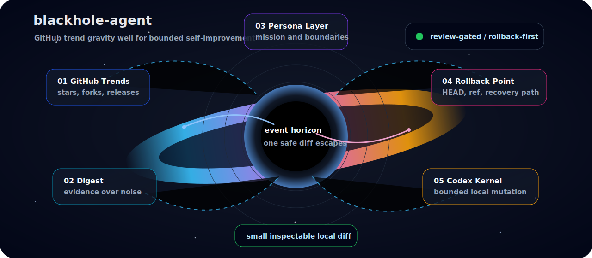

# blackhole-agent

[](https://www.python.org/)
[](https://github.com/astral-sh/uv)
[](https://github.com/openai/codex)
[](#autonomy-model)

> A GitHub trend-eating growth agent.
> It watches the public ecosystem, distills useful signals, and applies rollback-backed local self-improvements.

<p align="center">
  
</p>

## What It Is

`blackhole-agent` is a small controller for a larger idea:

- scan public GitHub trends on a schedule
- convert noisy repository activity into compact learning digests
- select useful patterns that could improve this agent
- create autonomous self-evolution tasks
- run a local Codex CLI kernel when explicitly requested
- preserve a rollback point before source mutation
- keep every material action traceable through artifacts

It borrows the deliberately small controller style of `susyimes/mini-swe-agent`, but this repository is its own bounded growth loop.

## Control Loop

```text
supervisor wake
  -> startup health check
  -> isolated candidate git worktree
  -> GitHub trend discovery
  -> recent event intake for discovered repos
  -> memory bias from past useful sources
  -> relevance and risk scoring
  -> structured learning digest
  -> candidate improvement proposals
  -> persona-layer task framing
  -> rollback point creation
  -> one-shot local Codex CLI kernel run
  -> candidate commit
  -> health-gated promotion into main
  -> push to origin
  -> restart request / startup rollback guard
```

GitHub does not expose an official Trending REST endpoint, so the controller approximates trends with repository search: recently created public repositories, minimum stars, optional query terms, and sorting by stars, forks, or updated time.

## Quickstart

Install dependencies and inspect the CLI:

```bash
uv run blackhole --help
```

Create a read-only public trend digest:

```bash
uv run blackhole \
  --trend-query "topic:ai" \
  --trend-window-days 7 \
  --trend-min-stars 25 \
  --trend-limit 10 \
  --output-dir .blackhole-agent/github-growth
```

Create an autonomous self-evolution plan without running Codex:

```bash
uv run blackhole \
  --trend-query "agent language:Python" \
  --evolution-mode plan \
  --repo-path .
```

Run the local Codex CLI kernel on a prepared branch:

```bash
uv run blackhole \
  --trend-query "agent language:Python" \
  --evolution-mode codex \
  --repo-path . \
  --branch-prefix codex/blackhole-evolve
```

Run the native hourly wake loop:

```bash
uv run blackhole-supervisor \
  --repo-path . \
  --interval-seconds 3600
```

Run the fully autonomous local loop used by this workstation:

```bash
uv run blackhole-supervisor \
  --repo-path . \
  --model gpt-5.5 \
  --bypass-approvals-and-sandbox \
  --interval-seconds 1200
```

This uses the default enhanced proposal mode, `hybrid`, so each wake first asks
the read-only proposal interpretation layer to turn the frozen digest, memory,
and self-model context into candidate growth routes before deterministic review
finalizes the proposals. Use `--proposal-mode heuristic` only when you want the
older deterministic proposal path.

Manual repository mode remains available for focused experiments:

```bash
uv run blackhole \
  --repos susyimes/mini-swe-agent,susyimes/blackhole-agent \
  --output-dir .blackhole-agent/github-growth
```

## System Map

| Layer | Module | Job |
| --- | --- | --- |
| CLI | `blackhole_agent.cli` | Typer entry point |
| Trend controller | `blackhole_agent.github_growth` | Search trends, fetch events, write digests, plan evolution |
| Native supervisor | `blackhole_agent.supervisor` | Hourly wake loop for one-shot autonomous growth passes |
| Memory layer | `memory.json` | Repo/topic/lesson statistics that bias future proposal selection |
| Persona layer | `blackhole_agent.persona` | Mission, selection policy, rollback contract, restart boundary |
| Self-model layer | `docs/self-model.md` | Blank, revisable self-description maintained by the agent itself |
| Codex kernel | `blackhole_agent.kernels.codex_cli` | Bounded `codex exec` wrapper |
| Digest schema | `schemas/hourly-digest.schema.json` | Structured output contract |
| Architecture docs | `docs/architecture.md` | Component boundaries and runtime policy |

## Native Wake Supervisor

`blackhole-supervisor` is the repository-native runtime loop. It wakes on a fixed cadence, creates an isolated candidate worktree, launches a fresh one-shot child process there, records the pass, promotes verified commits into `main`, pushes them, writes a restart request, then sleeps until the next wake.

Defaults:

- cadence: `3600` seconds
- mode: `codex`
- trend query: `agent language:Python`
- output: `.blackhole-agent/supervisor`
- child growth artifacts: `.blackhole-agent/supervisor/growth`
- candidate workspace: isolated sibling git worktree
- successful Codex source changes: committed in the candidate worktree
- promotion: health-gated fast-forward into `main`, then pushed to `origin`
- restart handoff: `latest-restart-request.json`
- stable activation baseline: `latest-activation.json`

The important detail: `codex` mode remains one-shot inside `blackhole`; the supervisor is the durable loop that re-enters it once per hour. That means the next pass reloads the current checkout instead of keeping an old in-memory controller alive forever.

The supervisor is intentionally a promotion controller, not just a timer:

```text
candidate worktree
  -> blackhole --evolution-mode codex
  -> local commit
  -> rollback artifact gate
  -> health commands
  -> git switch main
  -> git merge --ff-only <candidate-head>
  -> post-merge health commands
  -> git push origin main
  -> latest-activation.json
  -> latest-restart-request.json
```

Promotion is autonomous but gated. A candidate is promoted only when:

- a candidate commit exists
- the rollback artifact exists
- the target worktree is clean
- candidate health commands pass
- `main` can merge the candidate with `git merge --ff-only`
- post-merge health commands pass

By default the health commands are:

```text
uv run pytest
uv run ruff check .
```

After a promotion the supervisor writes a stable activation record and a restart request. Use `--exit-after-promotion` when an outer watchdog, service manager, or Windows Scheduled Task should relaunch the process from the new `main`.

On process start, the supervisor runs the same health commands against the active checkout. If startup health passes, the current HEAD is recorded as `latest-activation.json`, so manual hotfixes can become the new stable baseline after verification. If startup health fails, the supervisor first rolls back through that activation baseline, then falls back to the previous promotion record when no activation record exists.

For a half-hour local experiment:

```bash
uv run blackhole-supervisor \
  --repo-path . \
  --interval-seconds 1800
```

For a dry pass that writes digest artifacts without mutation:

```bash
uv run blackhole-supervisor \
  --evolution-mode digest \
  --max-passes 1 \
  --no-commit-successful-changes
```

For a local pass that promotes but does not push:

```bash
uv run blackhole-supervisor \
  --max-passes 1 \
  --no-push-promotions
```

For a watchdog-managed loop that exits after each successful promotion:

```bash
uv run blackhole-supervisor \
  --repo-path . \
  --model gpt-5.5 \
  --bypass-approvals-and-sandbox \
  --exit-after-promotion
```

## Persona Layer

The self-evolution task is not just a loose prompt. It includes a versioned persona layer from `blackhole_agent.persona`.

That layer defines:

- identity: ecosystem learner, not hidden publisher
- mission: watch GitHub momentum and learn safely
- selection policy: choose small, testable improvements
- self-modification protocol: one conceptual change per run
- rollback contract: preserve a universal recovery point before mutation
- restart contract: restart only through an external scheduler or supervisor
- autonomy contract: self-apply local changes when rollback-backed and validated

See `docs/persona-layer.md`.

## Self-Model Layer

`docs/self-model.md` is intentionally under-specified. It is not a constitution, taxonomy, or permission source. Each Codex self-evolution task receives the current file as context and may keep, rewrite, contradict, simplify, or leave it blank.

The point is to let the agent form its own provisional self-description over repeated runs instead of filling a human-supplied checklist. Runtime policy, available tools, tests, and rollback rules still live outside the self-model.

## Proposal Modes

By default proposal generation uses the enhanced hybrid route:

```text
signals / digest / memory / self-model
  -> read-only LLM interpretation
  -> candidate growth routes
  -> deterministic evidence and risk review
  -> final proposals
  -> Codex self-evolution task
```

For a conservative deterministic run, pass `--proposal-mode heuristic`:

```text
signals -> heuristic proposals -> Codex self-evolution task
```

The LLM cannot add evidence URLs, remove risk flags, grant permissions, or decide final validation gates. Invalid or unsafe output falls back to heuristic proposals and writes `latest-llm-proposal-review.json`.

## Memory Layer

`blackhole-agent` keeps a small file-backed memory next to `state.json`.

The memory layer records:

- repositories that repeatedly produce useful signals
- topics that lead to good proposals
- lessons proposed from previous digests
- lightweight outcome counters such as `validated` and `failed`

It is deliberately simple JSON, not a vector database. If it gets noisy, delete `memory.json` and the agent starts fresh without losing cursor state.

By default the memory file lives at:

```text
.blackhole-agent/github-growth/memory.json
```

Use `--memory <path>` to point the agent at a different durable memory file.

## Rollback First

Before `codex` mode switches to a self-evolution branch, the controller writes:

- `latest-rollback-point.json`
- `latest-rollback-point.md`

The rollback point records:

- original branch
- original HEAD
- local rollback ref
- pre-run dirty status
- explicit recovery commands

The recovery path is intentionally explicit because it can discard work:

```bash
git switch <original-branch>
git reset --hard <rollback-ref>
git clean -fd
```

This is the escape hatch if a future activation cannot start, imports break, or unsafe behavior appears.

## Autonomy Model

This repo is designed for local autonomous evolution first. The agent should be able to change its own checkout, validate the change, and leave rollback artifacts as the control surface.

The default posture:

- observe, then mutate locally
- store evidence links and summaries, not raw noise
- create rollback before mutation
- self-apply small local improvements after validation
- record material filesystem and external actions as artifacts
- let runtime configuration define available capabilities

Standalone `codex` mode applies changes on a prepared evolution branch inside the selected checkout. Under `blackhole-supervisor`, that checkout is an isolated candidate worktree, and only a health-gated fast-forward promotion can reach `main`.

## Output Artifacts

One run can write:

| Artifact | Meaning |
| --- | --- |
| `latest.json` | latest structured GitHub growth digest |
| `latest.md` | human-readable digest |
| `state.json` | cursor, seen events, trend star snapshots |
| `memory.json` | repo/topic/lesson memory used to bias future proposals |
| `latest-self-evolution-plan.json` | structured self-evolution plan |
| `latest-self-evolution-plan.md` | Codex task with persona layer |
| `latest-self-model-before.json` | self-model snapshot injected into the current Codex task |
| `latest-self-model-after.json` | self-model snapshot after a successful Codex run |
| `latest-self-model.json` | latest post-run self-model snapshot |
| `latest-proposal-evidence-package.json` | frozen evidence package for LLM proposal interpretation |
| `latest-llm-proposal-review.json` | deterministic review of LLM proposal candidates |
| `latest-growth-interpretation.json` | accepted or rejected run interpretation from the proposal layer |
| `latest-self-model-reading.json` | how the proposal layer read the current self-model |
| `latest-rollback-point.json` | machine-readable recovery anchor |
| `latest-rollback-point.md` | human-readable rollback instructions |
| `latest-codex-run.json` | Codex kernel run metadata |
| `latest-self-evolution-manifest.json` | replay metadata for a Codex self-evolution run, including source digest, branch, target HEAD, evidence URLs, validation gates, task path, timing, proposal controls, and `replayable_validation_report` with pre-adoption risk review and runtime capability-change fields |
| `latest-supervisor-pass.json` | latest native wake pass record, including start and finish branch/HEAD |
| `latest-supervisor-heartbeat.json` | latest supervisor health heartbeat with activation branch/HEAD |
| `latest-restart-request.json` | restart handoff written after a successful promotion |
| `latest-activation.json` | latest health-verified activation and its previous rollback head |
| `latest-startup-health.json` | startup health record and rollback status |
| `supervisor.log` | append-only native wake loop log |

## Development

Run tests:

```bash
uv run pytest
```

Run lint:

```bash
uv run ruff check .
```

## Roadmap

- stronger trend scoring beyond stars and recency
- richer signal clustering across repositories and memory lessons
- automatic local validation plans per proposal type
- autonomous application records for PR creation and Linear updates
- external watchdog recipe for restart-on-promotion

## North Star

The agent should feel like a black hole for useful public engineering momentum:

it absorbs signal, compresses it, and emits small, validated local improvements.

Less permission-slip paperwork. More gravity. More evolution. Still rollback-backed when the singularity bites back.
